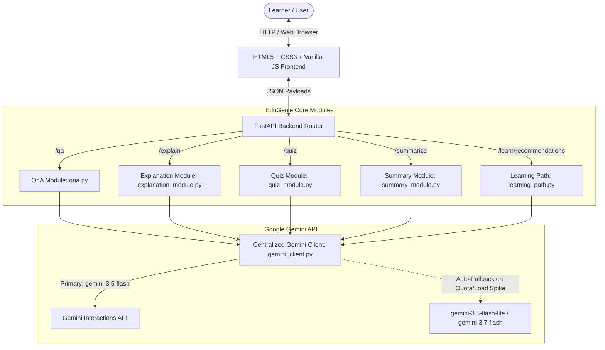

# EduGenie 🧠✨
### AI-Powered Educational Assistant Powered by Google Gemini

[](https://fastapi.tiangolo.com)
[](https://www.python.org/)
[](https://ai.google.dev/)
[](https://opensource.org/licenses/MIT)

**EduGenie** is a lightweight, responsive, and full-stack generative AI educational assistant. Designed for students, educators, and lifelong learners across all academic levels, EduGenie leverages Google Gemini to transform static study material into an interactive, personalized, and efficient learning journey.

---

## 🌟 Key Features

| Feature | Endpoint | Description |
|---|---|---|
| **❓ Smart Q&A** | `POST /qa` | Instant, accurate, and concise answers to academic and general knowledge questions with intuitive real-world examples. |
| **💡 Concept Explanation** | `POST /explain` | Breaks down intricate concepts into clear, jargon-free, beginner-friendly explanations with stepped points. |
| **📝 Interactive Quiz Generator** | `POST /quiz` | Generates 3 multiple-choice questions (MCQs) with 4 plausible options each. Features real-time in-browser answer evaluation (✅ Correct / ❌ Incorrect). |
| **📄 Passage Summarization** | `POST /summarize` | Condenses long study articles and notes into bullet-point revision summaries while preserving core insights. |
| **🗺️ Structured Learning Path** | `POST /learn/recommendations` | Builds a progressive curriculum roadmap (Beginner → Intermediate → Advanced) with suggested study resources and timelines. |

---

## 🏗️ System Architecture

EduGenie follows a modular client-server architecture built on **FastAPI** for high performance and asynchronous request handling, backed by the official **Google GenAI SDK**:



### High Resilience Design:
- **Centralized Model Manager**: Single configuration in `gemini_client.py` managing primary and fallback models.
- **Failover & Timeout Safeguards**: Automatic fallback chain prevents hanging on free-tier rate limits or transient cloud spikes.
- **Unified Error Handling**: FastAPI global exception handler ensures all endpoints return clean, structured JSON errors instead of unhandled 500 crashes.

---

## 📁 Project Directory Structure

```text
EduGenie/
├── static/
│   └── style.css            # Responsive CSS styling & interactive quiz UI styles
├── templates/
│   └── index.html           # Jinja2 frontend template with task forms and quiz evaluator
├── .env                     # Environment variables (GEMINI_API_KEY)
├── explanation_module.py    # Concept simplification logic
├── gemini_client.py         # Google Gemini client initialization, fallback, & timeouts
├── learning_path.py         # Personalized curriculum and roadmap generator
├── list_models.py           # Utility script to inspect available models for your API key
├── main.py                  # FastAPI application entry point, route definitions, & error handlers
├── qna.py                   # Question-answering module
├── quiz_module.py           # MCQ generation with JSON validation & fence stripping
├── requirements.txt         # Project dependencies
├── summary_module.py        # Educational text summarization logic
└── README.md                # Project documentation
```

---

## 🚀 Getting Started

### 1. Prerequisites
- **Python 3.10+** installed on your system.
- A **Google Gemini API Key** from [Google AI Studio](https://aistudio.google.com/apikey).

### 2. Clone / Open the Repository
```bash
cd EduGenie
```

### 3. Create and Activate a Virtual Environment
- **Windows (PowerShell):**
  ```powershell
  python -m venv .venv
  .venv\Scripts\Activate.ps1
  ```
- **macOS / Linux:**
  ```bash
  python3 -m venv .venv
  source .venv/bin/activate
  ```

### 4. Install Dependencies
```bash
pip install -r requirements.txt
```

### 5. Configure Your API Key
Create a `.env` file in the project root directory (or edit the existing one):
```env
GEMINI_API_KEY=your_actual_gemini_api_key_here
```

### 6. Run the Application
Start the Uvicorn ASGI development server with auto-reload:
```bash
uvicorn main:app --reload --host 127.0.0.1 --port 8000
```

### 7. Access EduGenie
- **Web Interface:** Open your browser and navigate to `http://127.0.0.1:8000/`
- **Interactive Swagger API Docs:** Navigate to `http://127.0.0.1:8000/docs`
- **ReDoc API Documentation:** Navigate to `http://127.0.0.1:8000/redoc`

---

## 📡 API Reference & Examples

All POST endpoints accept a JSON payload with a `question` string field:

### 1. Ask a Question (`POST /qa`)
**Request:**
```bash
curl -X POST "http://127.0.0.1:8000/qa" \
     -H "Content-Type: application/json" \
     -d '{"question": "Which is the largest ocean on Earth?"}'
```
**Response:**
```json
{
  "question": "Which is the largest ocean on Earth?",
  "answer": "The Pacific Ocean is the largest and deepest ocean on Earth..."
}
```

---

### 2. Explain a Concept (`POST /explain`)
**Request:**
```bash
curl -X POST "http://127.0.0.1:8000/explain" \
     -H "Content-Type: application/json" \
     -d '{"question": "What is gravity?"}'
```
**Response:**
```json
{
  "topic": "What is gravity?",
  "explanation": "Imagine gravity as an invisible force pulling objects toward each other..."
}
```

---

### 3. Generate a Quiz (`POST /quiz`)
**Request:**
```bash
curl -X POST "http://127.0.0.1:8000/quiz" \
     -H "Content-Type: application/json" \
     -d '{"question": "The solar system consists of the Sun and eight planets orbiting around it."}'
```
**Response:**
```json
{
  "quiz": [
    {
      "question": "How many planets orbit the Sun in our solar system?",
      "options": ["Seven", "Eight", "Nine", "Ten"],
      "answer": "Eight"
    }
  ]
}
```

---

### 4. Summarize Text (`POST /summarize`)
**Request:**
```bash
curl -X POST "http://127.0.0.1:8000/summarize" \
     -H "Content-Type: application/json" \
     -d '{"question": "The Industrial Revolution began in Great Britain in the mid-18th century..."}'
```

---

### 5. Learning Recommendations (`POST /learn/recommendations`)
**Request:**
```bash
curl -X POST "http://127.0.0.1:8000/learn/recommendations" \
     -H "Content-Type: application/json" \
     -d '{"question": "SQL and Relational Databases"}'
```

---

## 🧪 Testing Models Utility

To verify which models are available and active for your API key, run:
```bash
python list_models.py
```

---

## 🛠️ Technology Stack

- **Backend Framework:** [FastAPI](https://fastapi.tiangolo.com/)
- **Server:** [Uvicorn (ASGI)](https://www.uvicorn.org/)
- **AI Engine:** [Google GenAI SDK](https://github.com/googleapis/python-genai)
- **Templating:** [Jinja2](https://jinja.palletsprojects.com/)
- **Environment Management:** [python-dotenv](https://github.com/theskumar/python-dotenv)
- **Data Validation:** [Pydantic](https://docs.pydantic.dev/)
- **Frontend:** Vanilla HTML5, CSS3, JavaScript (Fetch API)

---

## 👥 Project Credits & Attribution

- **Project:** EduGenie: Google Gemini Powered Learning Assistant
- **Submitted by:** Tella Divya Sree
- **Mentor:** Siri
- **Program:** SmartBridge / SmartInternz

---

## 📄 License
This project is open-source and licensed under the [MIT License](LICENSE).
