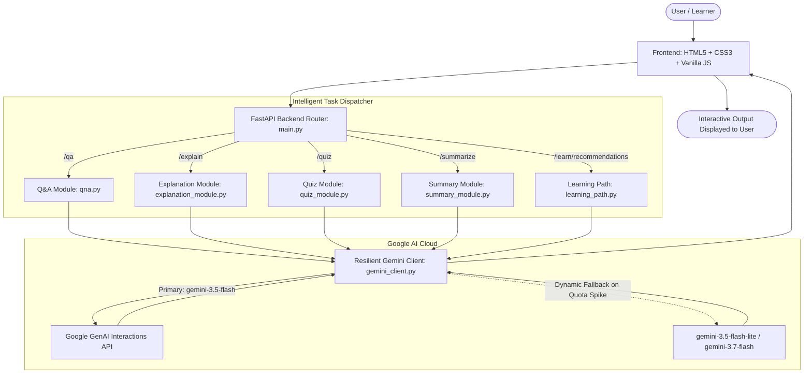

# EduGenie 🧠✨
### AI-Powered Educational Assistant Powered by Google Gemini

[](https://fastapi.tiangolo.com)
[](https://www.python.org/)
[](https://ai.google.dev/)

**EduGenie** is a lightweight, responsive, and full-stack generative AI educational assistant. Designed for learners, students, and educators of all academic levels, EduGenie simplifies learning by transforming educational concepts and materials into smart, concise, and interactive experiences powered by Google Gemini.

---

## 🎯 Project Overview

Traditional study materials can often feel overwhelming, dense, or static. EduGenie bridges this gap by acting as an on-demand personal study companion:
- **Instant Q&A**: Get smart, accurate, and concise answers to academic and general knowledge queries.
- **Simplified Explanations**: Break down complex scientific, mathematical, and technical concepts into plain language with real-world examples.
- **Interactive Quizzing**: Test knowledge with dynamically generated multiple-choice questions (MCQs) featuring real-time in-browser answer validation.
- **Concise Summaries**: Condense long passages and articles into key revision points without losing essential information.
- **Personalized Learning Paths**: Generate progressive, structured roadmaps (Beginner → Intermediate → Advanced) with suggested resources and realistic timelines.

---

## 💡 Real-World Scenarios

EduGenie is built to handle day-to-day educational tasks:

* **Scenario 1 (Quick Knowledge):** A student exploring geography asks *"Which is the largest ocean on Earth?"* and receives an instant, clear answer with key details.
* **Scenario 2 (Knowledge Assessment):** A student reviewing geometry enters *"The Pythagoras Theorem"*, generates a 3-question quiz, selects options via radio buttons, and receives immediate evaluation (`✅ Correct!` or `❌ Incorrect. Correct answer: ...`).
* **Scenario 3 (Guided Study Plan):** A learner starting out in data management requests a learning path for *"SQL"*, receiving a multi-week structured syllabus covering fundamentals, intermediate joins, advanced query optimization, and recommended resources.

---

## 🏗️ System Architecture

EduGenie follows a modular client-server architecture:



---

## 📁 Folder Architecture

```text
EduGenie/
├── static/
│   └── style.css            # Responsive CSS styling & interactive quiz UI styles
├── templates/
│   └── index.html           # Jinja2 frontend template with task forms and quiz evaluator
├── .env                     # Environment variables (GEMINI_API_KEY)
├── explanation_module.py    # Concept simplification logic
├── gemini_client.py         # Google Gemini client initialization, fallback, & timeouts
├── learning_path.py         # Personalized curriculum and roadmap generator
├── list_models.py           # Utility script to inspect available models for your API key
├── main.py                  # FastAPI application entry point, route definitions, & error handlers
├── qna.py                   # Question-answering module
├── quiz_module.py           # MCQ generation with JSON validation & fence stripping
├── requirements.txt         # Python dependencies
├── summary_module.py        # Educational text summarization logic
└── README.md                # Project documentation
```

---

## ⚙️ Prerequisites

- **Python 3.10+**
- **FastAPI** & **Uvicorn** (ASGI server)
- **Jinja2** (HTML Templating engine)
- **Google GenAI SDK** (`google-genai`)
- **Google Gemini API Key** (from [Google AI Studio](https://aistudio.google.com/apikey))

---

## 🚀 Getting Started

### 1. Clone / Navigate to the Project Folder
```bash
cd EduGenie
```

### 2. Create and Activate a Virtual Environment
- **Windows (PowerShell):**
  ```powershell
  python -m venv .venv
  .venv\Scripts\Activate.ps1
  ```
- **macOS / Linux:**
  ```bash
  python3 -m venv .venv
  source .venv/bin/activate
  ```

### 3. Install Dependencies
```bash
pip install -r requirements.txt
```

### 4. Configure Your API Key
Create or edit the `.env` file in the project root:
```env
GEMINI_API_KEY=your_actual_gemini_api_key_here
```

### 5. Start the Application
Run locally using Uvicorn with auto-reload:
```bash
uvicorn main:app --reload --host 127.0.0.1 --port 8000
```

### 6. Open in Browser
- **Web Application:** [http://127.0.0.1:8000](http://127.0.0.1:8000)
- **Interactive Swagger API Docs:** [http://127.0.0.1:8000/docs](http://127.0.0.1:8000/docs)
- **ReDoc API Documentation:** [http://127.0.0.1:8000/redoc](http://127.0.0.1:8000/redoc)

---

## 📡 Endpoints & API Reference

All functional endpoints accept a JSON payload with a `question` string field:

### 1. Q&A Module (`POST /qa`)
*Answers student questions with clear educational context.*
```bash
curl -X POST "http://127.0.0.1:8000/qa" \
     -H "Content-Type: application/json" \
     -d '{"question": "Which is the largest ocean?"}'
```

### 2. Concept Explanation (`POST /explain`)
*Provides simplified explanations with step-by-step breakdowns and examples.*
```bash
curl -X POST "http://127.0.0.1:8000/explain" \
     -H "Content-Type: application/json" \
     -d '{"question": "Explain Photosynthesis in simple words"}'
```

### 3. Quiz Generation (`POST /quiz`)
*Generates 3 MCQs with 4 options each and the correct answer in structured JSON format.*
```bash
curl -X POST "http://127.0.0.1:8000/quiz" \
     -H "Content-Type: application/json" \
     -d '{"question": "The solar system consists of the Sun and eight planets orbiting around it."}'
```

### 4. Summarization Module (`POST /summarize`)
*Condenses text into clean, structured revision bullet points.*
```bash
curl -X POST "http://127.0.0.1:8000/summarize" \
     -H "Content-Type: application/json" \
     -d '{"question": "The Industrial Revolution began in Great Britain in the late 18th century..."}'
```

### 5. Learning Path Recommendations (`POST /learn/recommendations`)
*Generates a phased curriculum (Beginner, Intermediate, Advanced) with timelines and resources.*
```bash
curl -X POST "http://127.0.0.1:8000/learn/recommendations" \
     -H "Content-Type: application/json" \
     -d '{"question": "Machine Learning"}'
```

---

## 🧪 Model Verification Utility

You can check which Gemini models are active and available for your API key by running:
```bash
python list_models.py
```

---

## 🛡️ Reliability & Error Handling

- **Automatic Model Fallback**: Primary requests use `gemini-3.5-flash` with dynamic fallback to alternative models (`gemini-3.5-flash-lite`, `gemini-3.7-flash`, etc.) to prevent failures during traffic spikes or rate limits.
- **Safety Timeouts**: Requests are protected by a 45-second execution timeout, eliminating infinite pending loops.
- **Structured Error Responses**: Global exception handlers return clean JSON error payloads (`{"error": "..."}`) to prevent unhandled 500 server crashes.

---
